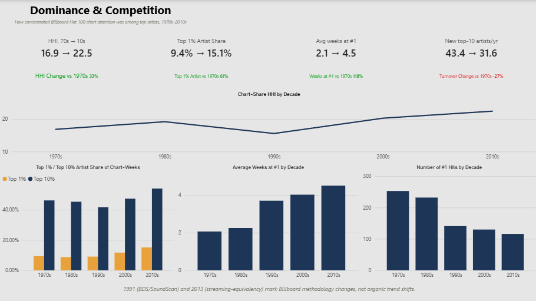
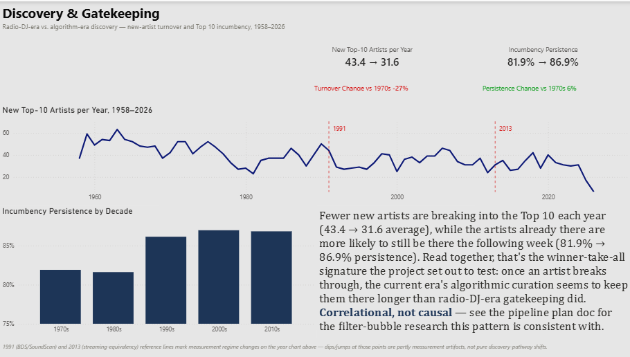
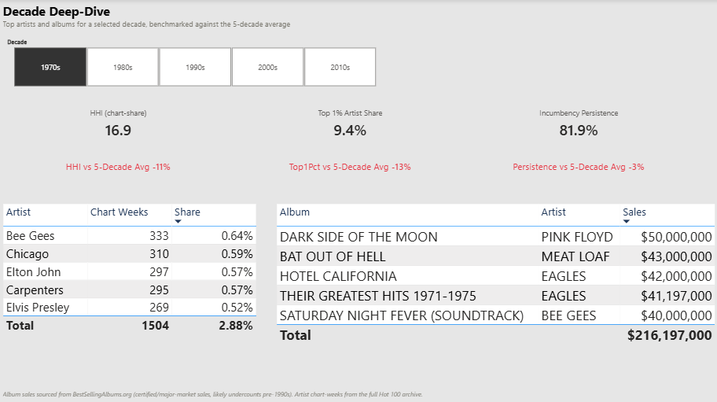

# Back in My Day: Music Industry Dominance & Discovery, 1970s–2010s

A data analysis project examining whether the Billboard Hot 100 became more winner-take-all over five decades — and whether the shift from radio-DJ gatekeeping to algorithmic curation helped drive it.

## The question

Every generation says "back in my day, the charts were different." This project tests that against Billboard's full historical archive along two angles:

- **Dominance & Competition** — did a shrinking pool of top artists capture a growing share of chart attention over time?
- **Discovery & Gatekeeping** — did the shift from radio-reported playlists to algorithmic/streaming-driven charts (Billboard's 1991 BDS/SoundScan switch, and the 2013 streaming-equivalency change) coincide with fewer new artists breaking through, and existing hits staying on top longer?

## Key findings

| Decade | HHI (chart-share) | Top 1% artist share | Avg. weeks at #1 | New Top-10 artists/yr | Incumbency persistence |
|---|---|---|---|---|---|
| 1970s | 16.9 | 9.4% | 2.1 | 43.4 | 81.9% |
| 1980s | 19.2 | 8.7% | 2.3 | 35.3 | 81.6% |
| 1990s | 15.6 | 9.0% | 3.7 | 34.8 | 86.2% |
| 2000s | 20.3 | 11.7% | 4.0 | 36.5 | 87.0% |
| 2010s | 22.5 | 15.1% | 4.5 | 31.6 | 86.9% |

Every concentration and persistence metric moves the same direction: chart attention has consolidated among fewer artists, #1 songs stay on top roughly twice as long as they did in the 1970s, and the annual rate of new artists breaking into the Top 10 has fallen. Read together, that's consistent with algorithmic-era curation producing a stronger winner-take-all effect than the radio-DJ era did — though the data shows correlation, not causation (see Limitations below).

One metric runs the opposite direction: album-sales concentration among the top 50 sellers per decade *declines* into the 2010s, most likely because streaming eroded "the album" as a meaningful unit of measurement in that decade rather than reflecting less dominance.

## Dashboard

Three-page Power BI dashboard built on top of the pipeline output.

### Page 1 — Dominance & Competition


### Page 2 — Discovery & Gatekeeping


### Page 3 — Decade Deep-Dive


## Methodology

- **HHI (Herfindahl-Hirschman Index)** — sum of squared artist shares of Hot 100 chart-weeks per decade, on the standard 0–10,000 scale. Higher = more concentrated among fewer artists.
- **Top 1% / Top 10% artist share** — plain-English version of the same idea: what share of all chart-weeks that decade went to the top 1%/10% of artists by chart-week count.
- **#1 song longevity** — average and median weeks a song held the #1 spot, plus the share of #1 weeks held by the top 5 artists that decade.
- **New-artist entry rate (turnover)** — count of artists reaching the Top 10 for the first time ever, computed against the *full* 1958–present archive (not just the 5 comparison decades) so a 1970s artist charting again later isn't miscounted as "new."
- **Incumbency persistence** — week-over-week overlap in the Top 10, averaged per decade, computed only across genuinely consecutive (7-day) chart weeks to avoid bridging real archive gaps.

Full methodology detail, including known measurement-regime breaks (1991 BDS/SoundScan switch, 2013 streaming-equivalency change), is in `Back_in_My_Day_Data_Pipeline_Plan.docx` and `DATA_NOTES.md`.

## Data sources

- Billboard Hot 100 and Billboard 200 weekly charts, 1958/1967–present (`utdata/rwd-billboard-data` GitHub archive)
- Top 50 best-selling albums per decade (scraped from BestSellingAlbums.org)
- RIAA Gold/Platinum/Diamond certification counts (`daveking63/Billboard-and-RIAA-datasets`)
- RIAA US music revenue benchmarks — 9 hand-compiled years, used for scale/context only, not trend

Full source-by-source notes and known gaps are in `DATA_NOTES.md`.

## Limitations

- 1991 and 2013 are Billboard *methodology* changes (radio-reported → BDS airplay + SoundScan sales; then streaming-equivalency added), not organic trend continuities — they're annotated on the relevant charts, not smoothed over.
- RIAA revenue benchmarks have real gaps (no clean 1980/1990 figures) and are for context only.
- BestSellingAlbums.org sales figures likely undercount pre-1990s and non-US markets (their own stated caveat).
- Correlational, not causal — the data is consistent with an algorithmic-curation explanation for rising concentration, but doesn't isolate it from other confounds (genre fragmentation, format shifts, etc.).

## Repo structure

```
├── py/                                            ETL + metrics pipeline (run in order: 01 → 02 → 03)
├── csv/                                           Raw + computed source data
├── screenshots/                                   Dashboard page exports
├── back_in_my_day.db                              SQLite database (raw + computed tables)
├── Back-in-My-Day-Music-Industry-Analysis.pbix    Power BI dashboard
├── Back_in_My_Day_Data_Pipeline_Plan.docx         Full methodology + pipeline plan
├── DATA_NOTES.md                                  Source-by-source data notes and known gaps
└── PowerBI_Build_Guide.md                         Step-by-step Power BI build reference
```

## Reproducing the pipeline

```
python py/01_load_sqlite.py
python py/02_compute_decade_metrics.py
python py/03_update_sqlite_metrics.py
```

Requires `pandas`. Open `Back-in-My-Day-Music-Industry-Analysis.pbix` in Power BI Desktop to explore the dashboard, or open `Dashboard_Preview.html` in a browser for a lightweight non-Power-BI preview of the same data.

## Tools

Python (pandas), SQLite, Power BI Desktop.
